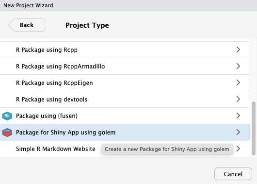

<!-- README.md is generated from README.Rmd. Please edit that file -->

```{r setup, include = FALSE}
knitr::opts_chunk$set(
  collapse = TRUE,
  eval = TRUE,
  comment = "#>",
  fig.path = "man/figures/README-",
  out.width = "100%",
  fig.align = "center"
)
```

<!-- badges: start -->

```{r echo = FALSE}
name_branch <- gert::git_branch()
link_to_branch_svg <- paste0(
  "https://codecov.io/gh/ThinkR-open/golem/branch/",
  name_branch,
  "/graph/badge.svg"
)
link_to_branch_html <- paste0(
  "https://app.codecov.io/github/ThinkR-open/golem/tree/",
  name_branch
)
```


[](https://cran.r-project.org/package=golem)
[](https://CRAN.R-project.org/package=golem)
[](https://CRAN.R-project.org/package=golem)

```{r, echo = FALSE, results = "asis"}
cat("[](https://github.com/ThinkR-open/golem/actions)")
cat("")
cat(paste0("\n[](", link_to_branch_html, ")"))
```

<!-- badges: end -->

# {golem} 

`Golem` is an opinionated framework for building production-grade shiny applications. 
It is designed to help you build robust, maintainable shiny apps, with a consistent structure and workflow. 

This package helps you to:

- **Build** a shiny application with a solid foundation inside a package,
- **Develop** your application in a robust and scalable way,
- **Test** your application with a set of tools and best practices,
- **Deploy** your application in a production-ready environment.

## Installation

You can install the stable version from CRAN with:

``` r
install.packages("golem")
```

You can install the development version from [GitHub](https://github.com/Thinkr-open/golem) with:

``` r
# install.packages("remotes")
remotes::install_github("Thinkr-open/golem")
```

## Create a new application with `golem`

### With RStudio

If you are developping in RStudio, you can use the `golem` RStudio addin to create a new application.

Go to `File` > `New Project` > `New Directory` > Search for `Package for Shiny App using golem`:

```{r, echo=FALSE, out.width="80%", eval=TRUE}

```

### With R

You can also create a new application with the following R code:

```{r eval = FALSE}
golem::create_golem("mygolemapp")
```

Run this code in your R console will create a new golem application in a folder called `mygolemapp` where you run the code.

A new Rstudio window will open with the new project.

## Launch your app

Once your project is created, you can run your app with the following code:

```{r eval = FALSE}
golem::run_dev()
```

Enjoy your new app!

## Play with golem

### Your very first time with golem

You can find find a full tutorial on how to create your first `golem` app [here](x).

A lot of resources are available to help you get started with `golem` [here](x).

### Contribute

You love `golem` and want to contribute? Check out our documentation on how to contribute [here](x).


## Code of Conduct

Please note that this project is released with a [Contributor Code of Conduct](https://www.contributor-covenant.org/version/1/0/0/code-of-conduct.html). 
By participating in this project you agree to abide by its terms.
