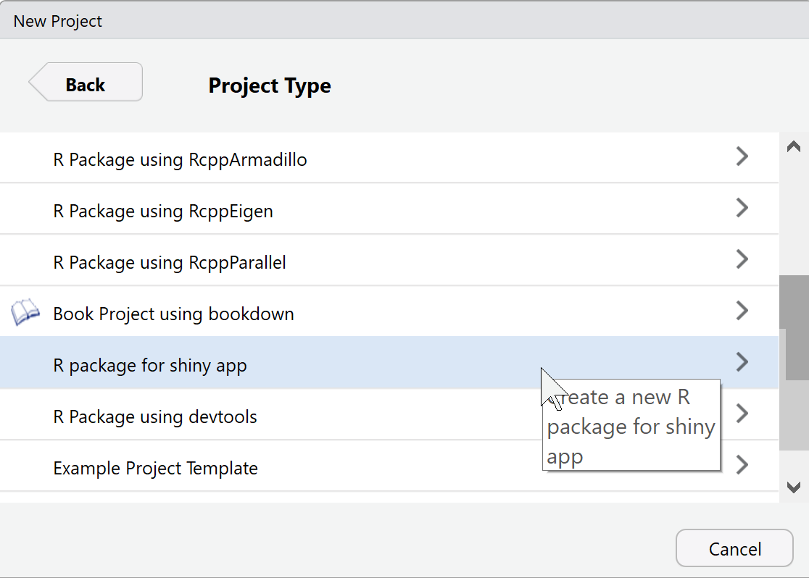

# shinytemplate

This R package propose a RStudio project templates dedicated to shinyapps

Install this package with:

```r
devtools::install_github("ThinkR-open/shinytemplate")
```
    
Create a new Rstudio project in a new directory:



Run the example:

```r
devtools::document()
devtools::load_all()
shinyexample::run_app()
```
