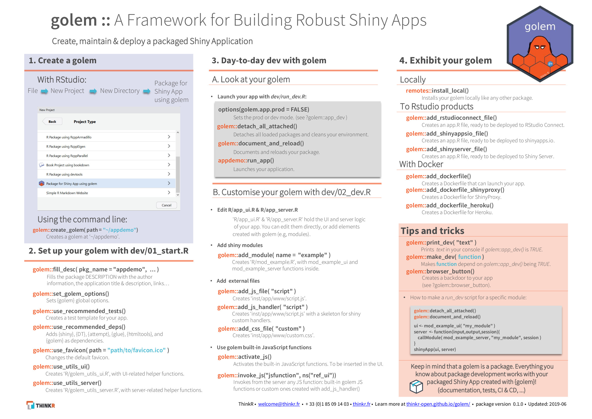

`golem` is part of the [`{golemverse}`](https://golemverse.org/), a series of tools for building production `Shiny` apps.

This page lists the main entry points. The full catalogue of `golem` resources (tutorials, videos, blog posts, conference talks since 2019,...) is kept up to date at <https://golemverse.org/resources/>.

# Book

[Engineering Production-Grade Shiny Apps](https://engineering-shiny.org/) is the method behind `golem`: design, prototype, build, test, deploy.
It is free to read online, and also available [in print](https://www.routledge.com/Engineering-Production-Grade-Shiny-Apps/Fay-Rochette-Guyader-Girard/p/book/9780367466022) in the R Series by Chapman and Hall/CRC.

If you are new to `golem`, [Getting started with {golem}](https://rtask.thinkr.fr/getting-started-with-golem/) is a good first read.

# Cheatsheet

The high-resolution `golem` cheatsheet is available to download here: <https://thinkr.fr/golem_cheatsheet_V0.1.pdf>

<a href="https://thinkr.fr/golem_cheatsheet_V0.1.pdf">
```{r, echo=FALSE, out.width="100%"}

```
</a>

# Agent skills

`golem` ships a set of skills that teach coding agents the `golem` conventions: creating an app, adding modules and functions, running tests, upgrading a project.
Install them in an existing project with `use_agent_skills()`, or at creation time with `create_golem(with_agents = TRUE)`.

The skills are also distributed as a standalone plugin: <https://github.com/ThinkR-open/golem-agent-skills>

# Videos and talks

A few entry points, see [the golemverse](https://golemverse.org/resources/) for the complete list:

- [Production-grade Shiny Apps with golem](https://posit.co/resources/videos/production-grade-shiny-apps-with-golem/), rstudio::conf(2020), by Colin Fay and Vincent Guyader
- [Golem is a Must-Know Framework For R-Shiny (and here's how to use it)](https://www.youtube.com/watch?v=FEWJsoDewgk), by Albert Rapp
- [Shiny and Golem](https://www.youtube.com/playlist?list=PLXCrMzQaI6c1Na7BE18OsWtE1WKqrclNn), a playlist by the NHS Open Analytics Community

# Examples apps

You can find apps made by [ThinkR](https://thinkr.fr/) using `golem` here:

- <https://connect.thinkr.fr/connect/>
- <https://github.com/ColinFay/golemexamples>

These are examples **from the community**. Please note that they may not necessarily be written in a canonical fashion and may have been written with different versions of `golem` or [`Shiny`](https://shiny.posit.co/).

- [tenzing](https://github.com/marton-balazs-kovacs/tenzing), documenting contributorship with CRediT
- [thinkCausal](https://github.com/priism-center/thinkCausal_dev), point-and-click causal inference
- [RNAseqTool](https://github.com/ChaoXu1997/RNAseqTool), interactive RNAseq analysis and visualisation
- [wheretowork](https://github.com/NCC-CNC/wheretowork), systematic conservation planning
- [fieldactivity](https://github.com/PecanProject/fieldactivity), field activity tracking for the Field Observatory project
- [nhp_elicitation_tool](https://github.com/The-Strategy-Unit/nhp_elicitation_tool), elicitation tool for the NHS New Hospital Programme
- [vcrshiny](https://github.com/seanhardison1/vcrshiny), research data from the Virginia Coast Reserve LTER
- [healthcareSPC](https://github.com/Nottingham-and-Nottinghamshire-ICS/healthcareSPC), healthcare use over time with SPC
- [cranstars](https://github.com/shahreyar-abeer/cranstars), CRAN downloads and GitHub stars

Do you have a `golem` app you'd like to share? Please open a PR to add it to this list!
