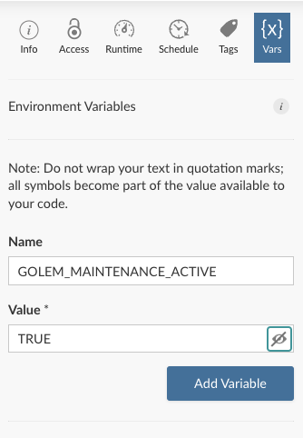

From time to time, you need your application to be unavailable: database update, API changes, etc... 

In order to **keep your app running but make it unavailable, you can use a maintenance mode**. When this maintenance mode is turned on, your application will be paused and a specific page will be displayed to your users.

`Golem` comes with a default maintenance page - but - you can override it with your own.

## Turn on the maintenance mode

The maintenance mode will be turned on whenever the R process detects that the `GOLEM_MAINTENANCE_ACTIVE` environment variable is set to `TRUE`.

### Locally

To visualize the maintenance page locally, you can run the following:

```{r eval=FALSE}
withr::with_envvar(
  c("GOLEM_MAINTENANCE_ACTIVE" = TRUE),
  {
    golem::run_dev()
  }
)
```

You can also set this environment variable in your environment:

```{r eval=FALSE}
Sys.setenv("GOLEM_MAINTENANCE_ACTIVE" = TRUE)
golem::run_dev()
```

### Deploy on Posit Connect

If you are deploying on **Posit Connect**, you can set this variable in the setup panel.

```{r, echo=FALSE, fig.align="center", out.width="40%"}

```

### Deploy with command line

If you are deploying your application with a command line, you can set the environment variable before running the application:

```
export GOLEM_MAINTENANCE_ACTIVE=TRUE && Rscript -e "mygolem::run_app()"
```

## Customize the maintenance page

`Golem` comes with a default maintenance page, but you can override it and **use your own custom page**.

In order to use your own page, you need to pass either an `html_document` or a `tagList` to the `with_golem_options` function in `run_app.R`:

Here an example of a custom maintenance page with a `tagList`:

```{r eval=FALSE}
run_app <- function(
    onStart = NULL,
    options = list(),
    enableBookmarking = NULL,
    uiPattern = "/",
    ...) {
  with_golem_options(
    app = shinyApp(
      ui = app_ui,
      server = app_server,
      onStart = onStart,
      options = options,
      enableBookmarking = enableBookmarking,
      uiPattern = uiPattern
    ),
    golem_opts = list(...),
    maintenance_page = tagList(
      fluidRow(
        h1("Under maintenance"),
        span("Coming soon...")
      )
    )
  )
}
```

This will display a simple page with a title and a message.

You can also create a full `html_document` and pass it to the `maintenance_page` argument.

Create a new html file in the `inst` folder of your package. For example, `inst/custom_maintenance_page.html`:

Then you can use this file in your `run_app.R`:

```{r eval=FALSE}
run_app <- function(
    onStart = NULL,
    options = list(),
    enableBookmarking = NULL,
    uiPattern = "/",
    ...) {
  with_golem_options(
    app = shinyApp(
      ui = app_ui,
      server = app_server,
      onStart = onStart,
      options = options,
      enableBookmarking = enableBookmarking,
      uiPattern = uiPattern
    ),
    golem_opts = list(...),
    maintenance_page = shiny::htmlTemplate(
      filename = app_sys(
        "custom_maintenance_page.html"
      )
    )
  )
}
```
