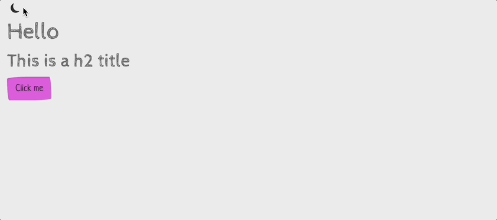

## Use bslib with Golem

When you create a new Golem application, `app_ui.R` is created with the `shiny::fluidPage()` function. 

By default, the `fluidPage()` function uses **Bootstrap 3**. 

It is possible to use **Bootstrap 4** or **Bootstrap 5** with the `bslib` package.

First make sure you have the `bslib` package installed:

```r
install.packages("bslib")
```

Then, we need to modify the `app_ui.R` file to use `bslib`.

### Modify the `app_ui.R` file

In the `app_ui.R` file, create a new function:

```{r eval=FALSE}
#' @import bslib
#' @noRd
my_application_theme <- function(version = bslib::version_default()) {
  bs_theme(
    version = version
  )
}
```

Then, modify the `fluidPage()` function to use the `my_application_theme()` function:

```{r eval=FALSE}
#' The application User-Interface
#'
#' @param request Internal parameter for `{shiny}`.
#'     DO NOT REMOVE.
#' @import shiny
#' @noRd
app_ui <- function(request) {
  tagList(
    # Leave this function for adding external resources
    golem_add_external_resources(),
    # Your application UI logic
    fluidPage(
      theme = my_application_theme(),
      h1("Hello"),
      h2("This is a h2 title"),
      actionButton(
        inputId = "go",
        label = "Click me"
      )
    )
  )
}
```

::: {.callout .callout-note}
::: {.callout-body}
Note that we remove the `golem::golem_welcome_page()` function to add some content to the `fluidPage()` function.

:::
:::

Now your application uses `bslib` with the default version.

If you want to use specifically Bootstrap 5, you can modify the `my_application_theme()` function:

```{r eval=FALSE}
my_application_theme <- function() {
  bs_theme(
    version = 5
  )
}
```

We also recomand to use the `bslib` page fluid function:

```{r eval=FALSE}
app_ui <- function(request) {
  tagList(
    # Leave this function for adding external resources
    golem_add_external_resources(),
    # Your application UI logic
    bslib::page_fluid(
      theme = my_application_theme(),
      h1("Hello"),
      h2("This is a h2 title"),
      actionButton(
        inputId = "go",
        label = "Click me"
      )
    )
  )
}
```

More information about `bslib` page layout can be found [here](https://rstudio.github.io/bslib/reference/page.html).


## Change the theme of your application

Once you have set up `bslib`, you can change the theme of your application by modifying the `my_application_theme()` function.

For example, to use the `cerulean` theme:

```{r eval=FALSE}
my_application_theme <- function(version = bslib::version_default()) {
  bs_theme(
    version = version,
    bootswatch = "sketchy"
  )
}
```

```{r, echo=FALSE, fig.align="center", out.width="100%"}

```

You can find the list of available themes with `bslib::bootswatch_themes()` or on the bootswatch website: <https://bootswatch.com/>.

## Customize your application with your own variables

You can also use your own variables with `bslib`.

For example, to use a custom color:

```{r eval=FALSE}
my_application_theme <- function(version = bslib::version_default()) {
  bs_theme(
    version = version,
    bootswatch = "sketchy",
    bg = "#dedede",
    fg = "#eca72b",
    primary = "#e91e63"
  )
}
```

We modify the `actionButton` function to use the `btn-primary` class:

```{r eval=FALSE}
app_ui <- function(request) {
  tagList(
    # Leave this function for adding external resources
    golem_add_external_resources(),
    # Your application UI logic
    bslib::page_fluid(
      theme = my_application_theme(),
      h1("Hello"),
      h2("This is a h2 title"),
      actionButton(
        inputId = "go",
        label = "Click me",
        class = "btn-primary"
      )
    )
  )
}
```

```{r, echo=FALSE, fig.align="center", out.width="100%"}

```

::: {.callout .callout-note}
::: {.callout-body}
Use a bootswatch theme is not mandatory, you can use your own variables to fully customize your application.

More details about Bootstrap variables can be found [here](https://rstudio.github.io/bslib/articles/bs5-variables/index.html).
:::
:::

## Use a dark theme

To use a dark theme, you can modify the `my_application_theme()` function:

```{r eval=FALSE}
my_application_theme <- function(
    version = bslib::version_default(),
    dark = FALSE) {
  if (dark) {
    bslib::bs_theme(
      version = version,
      bootswatch = "sketchy",
      bg = "#2c2c2c",
      fg = "#ffffff",
      primary = "#db5ddb"
    )
  } else {
    bs_theme(
      version = version,
      bootswatch = "sketchy",
      bg = "#dedede",
      fg = "#eca72b",
      primary = "#e91e63"
    )
  }
}
```

We added a `dark` argument to the `my_application_theme()` function.

To see the dark theme, you can modify the `app_ui` function:

```{r eval=FALSE}
app_ui <- function(request) {
  tagList(
    # Leave this function for adding external resources
    golem_add_external_resources(),
    # Your application UI logic
    bslib::page_fluid(
      theme = my_application_theme(dark = TRUE),
      h1("Hello"),
      h2("This is a h2 title"),
      actionButton(
        inputId = "go",
        label = "Click me",
        class = "btn-primary"
      )
    )
  )
}
```

```{r, echo=FALSE, fig.align="center", out.width="100%"}

```

Now, we'd like to be able to switch between the light and dark theme. We can add a `switchInput` to the UI:

They are several ways to do this. Here some of them:

### Using bslib toggle input

In the `app_ui` function, we add a `bslib::input_dark_mode` function:

```{r eval=FALSE}
app_ui <- function(request) {
  tagList(
    # Leave this function for adding external resources
    golem_add_external_resources(),
    # Your application UI logic
    bslib::page_fluid(
      theme = my_application_theme(dark = TRUE),
      bslib::input_dark_mode(),
      h1("Hello"),
      h2("This is a h2 title"),
      actionButton(
        inputId = "go",
        label = "Click me",
        class = "btn-primary"
      )
    )
  )
}
```

```{r, echo=FALSE, fig.align="center", out.width="100%"}

```

### Using your own button

It's also possible to switch between the light and dark theme with your own button.

Choose where you want to place the button (or any other input) in your UI. Then, in the server side, you can swith the theme with the `bslib::toggle_dark_mode()` function:

```{r eval=FALSE}
app_server <- function(input, output, session) {
  # Your application server logic

  observeEvent(input$go, {
    bslib::toggle_dark_mode()
  })
}
```

```{r, echo=FALSE, fig.align="center", out.width="100%"}

```
