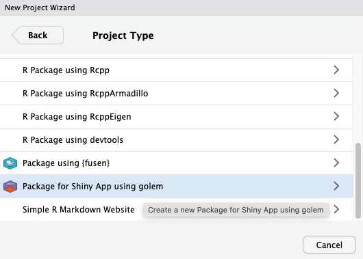

# Create a new application with `golem`

First, you need to install the `golem` package. 

## Installing {golem}

You can install the stable version of `{golem}` from CRAN:

``` {r eval=FALSE}
install.packages("golem")
```

The development version of `{golem}` can be installed from GitHub using the `{remotes}` package:
```{r eval=FALSE}
remotes::install_github("Thinkr-open/golem")
```

## Getting started

Note before using `golem`:

- A `golem` app is contained inside a package, so knowing how to build a package is highly recommended. On the plus side, everything you know about package development can be reused in `golem`.

- A `golem` app works better if you are working with `shiny modules`, so knowing how modules work is recommended, but not mandatory. 

A dedicated articles on modules is available [here](https://shiny.rstudio.com/articles/modules.html). And more specifically on how to use modules with `golem` [here]().

## Create a package

In case you are using RStudio, you can use the `golem` RStudio addin to create a new application.

Go to `File` > `New Project` > `New Directory` > Search for `Package for Shiny App using golem`:

```{r, echo=FALSE, fig.align="center", out.width="60%"}

```

You can also create a new application with the following R code:

```{r eval = FALSE}
golem::create_golem(path = "path/to/package/mygolemapp")
```

::: {.callout .callout-danger}
::: {.callout-body}
By passing the `check_name` argument to `FALSE`, this command allows you to create "illegally-named" package (for example, `1234`).  

Note that this is not recommended and __should only be done if you know what you are doing__.
:::
:::

Run this code in your R console will create a new golem application in a package called `mygolemapp` in the folder `path/to/package`.

A new Rstudio window will open with the new project.

